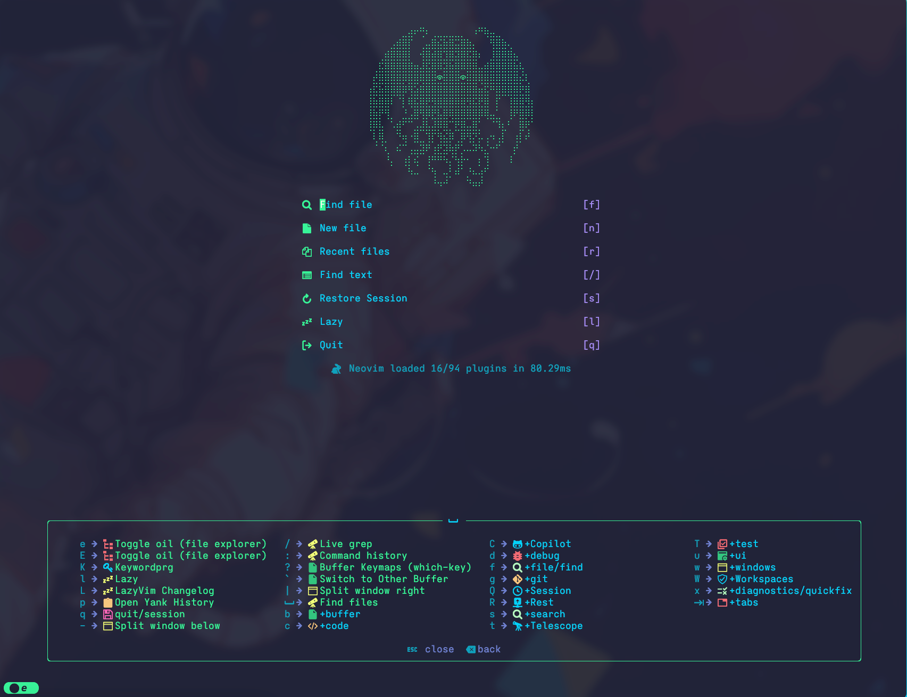
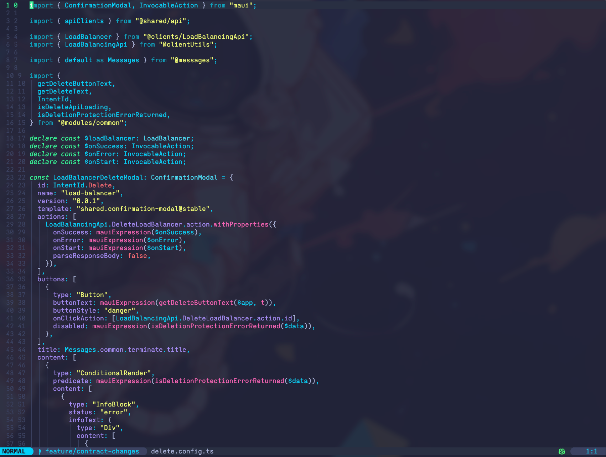

# NVIM config

- Originally I had my own custom rolled config,
but I have moved it to work off of LazyVim.
I have added a few plugins and some custom keybindings,
but the majority of the config is from LazyVim.

